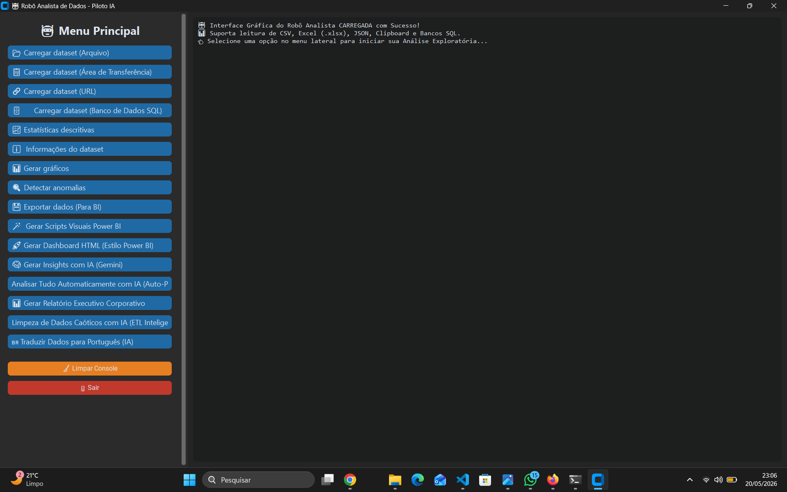
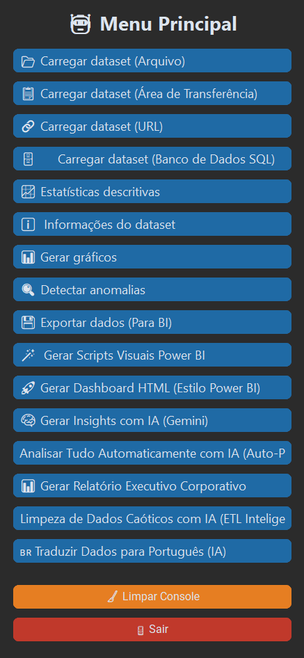
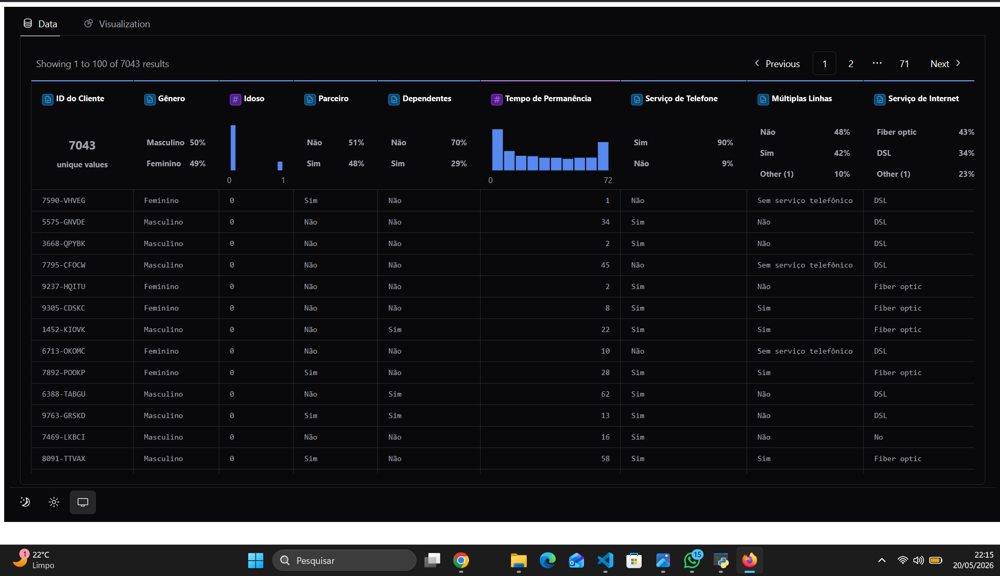
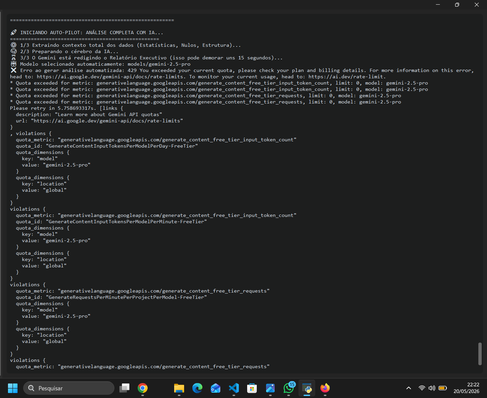

# 🤖 Robô Analista de Dados

## 📌 Sobre o Projeto
O Robô Analista de Dados é uma ferramenta completa projetada para acelerar o processo de Análise Exploratória de Dados (EDA). Ele permite carregar arquivos de múltiplas fontes, gerar estatísticas planejadas, criar gráficos automáticos, detectar anomalias e emitir relatórios executivos escritos próprios por IA.

Ideal para Cientistas de Dados, Analistas de BI e profissionais que desejam automatizar tarefas repetitivas e focar na concentração de valor.

## ✨ Funcionalidades (Recursos)
- **Interface Gráfica Moderna:** UI elegante em Dark Mode feita com CustomTkinter (Não requer uso do terminal!).
- **Carregamento Multi-Fonte:** Suporte CSV, Excel, JSON, Área de Transferência, URLs Diretas e Bancos de Dados SQL.
- **Análise Exploratória Rápida:** Geração de estatísticas descritivas e contagem de valores nulos com 1 clique.
- **Visualização de Dados:** Geração automática de Histogramas, Heatmaps de Correlação e Gráficos de Barras.
- **Integração com Power BI:** Exportação de dados limpos e geração de scripts Python em Plotly para visuais 100% interativos no Power BI.
- **Dashboard HTML:** Criação de interface drag-and-drop (arrastar e soltar) estilo Tableau usando PyGWalker.
- **Inteligência Artificial (Gemini):**
  - 🔍 **Detecção de Anomalias:** Identifique outliers e use IA para explicar possíveis causas no mundo real.
  - 🧠 **Insights Executivos:** Gera um resumo dos 3 principais indicadores de negócio baseados na amostra.
  - 🚀 **Piloto Automático:** Analise todo o conjunto de dados e redige um relatório técnico avançado em formato Markdown.

## 📸 Galeria (Capturas de tela)

### 1. Interface Gráfica (Novo!)


### 2. Menu Principal sem Terminal


### 3. Painel Interativo (PyGWalker)


### 4. Relatórios Gerados pelo Gemini


## 🚀 Como Executar o Projeto

### 📦 Opção 1: Usando o Executável (.exe) - Para Usuários Windows
A maneira mais fácil de usar é baixar a versão compilada, que não exige instalação do Python!

1. Acesse a aba **Releases** deste repositório no GitHub.
2. Baixe o arquivo `Robo_Analista_IA.exe`.
3. Crie um arquivo chamado `.env` na mesma pasta do executável e coloque sua chave de API do Google Gemini (veja como no arquivo `.env.example`).
4. Dê dois cliques no `Robo_Analista_IA.exe` e aproveite!

### 💻 Opção 2: Rodando pelo Código-Fonte (Para Desenvolvedores)
1. Clone este repositório:
   ```bash
   git clone https://github.com/Wagao220810/robo-analista-dados.git
   cd robo-analista-dados
   ```
2. Instale as dependências necessárias:
   ```bash
   pip install -r requirements.txt
   ```
3. Execute o robô:
   ```bash
   python robo_analista_dados.py
   ```

## 🏗️ Arquitetura e Código Limpo
Este projeto foi desenvolvido utilizando boas práticas de engenharia de software:

- **Tabela de Despacho:** Substituição de cadeias complexas de `if/else` por um dicionário de ações para o menu, tornando o código modular e fácil de expandir (OCP - Open/Closed Principle).
- **Decoradores Customizados:** Criação do decorador `@dados_carregados_required` para validação de estado, evitando redundância de código antes de executar análises.
- **Tratamento de Exceções (Fail-Fast):** Captura robusta de erros ao importar bibliotecas, ler arquivos de formatos desconhecidos ou falhas na API do Gemini.

## 🤝 Contribuindo
Contribuições são sempre bem-vindas! Se você tem alguma ideia para melhorar o robô, sinta-se à vontade para abrir uma *Issue* ou enviar um *Pull Request*.

1. Faça um Fork do projeto
2. Crie uma Branch para sua Feature (`git checkout -b feature/NovaFuncionalidade`)
3. Faça o Commit com suas mudanças (`git commit -m 'Adicionando nova funcionalidade'`)
4. Faça o Push para a Branch (`git push origin feature/NovaFuncionalidade`)
5. Abra um Pull Request

---
Feito com ☕ e 🐍 por Wagner